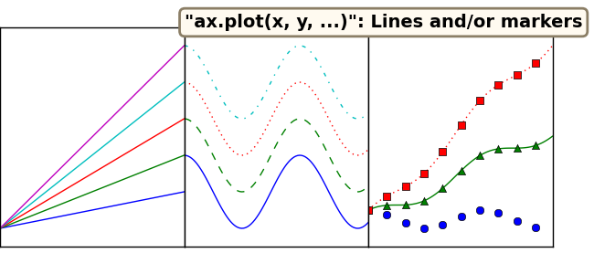
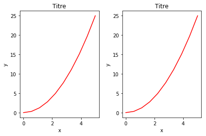

# Introduction à Matplotlib

<span style="color:blue; font-family:Georgia; font-size:1.5em;">Ahmed Ammar et Hassen Ghalila</span>
<span style="color:blue; font-family:Georgia; font-size:1em;">Faculté des Sciences de Tunis, Université de Tunis El Manar</span>

```python
#Juste pour savoir la dernière fois que cela a été exécuté:
import time
print(time.ctime())
```

    Mon May  8 17:29:03 2017


## Introduction

Matplotlib est une excellente bibliothèque graphique 2D et 3D pour générer des figures scientifiques. Voici quelques-uns des nombreux avantages de cette bibliothèque:

* Facile à utiliser
* Prise en charge des étiquettes et des textes formatés $ \ LaTeX $
* Un excellent contrôle de chaque élément d'une figure, y compris la taille de la taille et le DPI.
* Sortie de haute qualité dans de nombreux formats, y compris PNG, PDF, SVG, EPS.
* GUI pour explorer interactivement les figures.

## Documentation en ligne et Galerie
Vous trouverez plus d'informations, y compris une documentation complète et une vaste galerie d'exemples, à la page Web de Matplotlib: http://matplotlib.org/

De nombreux utilisateurs de matplotlib sont souvent confrontés à la question: "*Je veux faire un graphe qui a X avec Y dans la même figure, mais il doit ressembler à Z*". Bonne chance d'obtenir une réponse, à partir d'une recherche sur Internet avec cette requête. C'est pourquoi la [galerie](http://matplotlib.org/gallery.html) est si utile, car elle montre la variété des façons dont on peut faire des parcelles. Parcourez la galerie, cliquez sur n'importe quelle figure qui comporte des éléments de ce que vous voulez voir le code qui l'a généré. Bientôt, vous serez comme un chef, mélangez et associez des composants pour produire votre chef-d'œuvre!

## Anatomie d'un "Plot"


La ``Figure`` est le conteneur de niveau supérieur dans cette hiérarchie. C'est la fenêtre générale / page sur laquelle tout est dessiné. Vous pouvez avoir plusieurs chiffres indépendants et `` Figure``s peuvent contenir plusieurs "Axes".

La plupart des octets de traçage sur `` Axes``. Les axes sont effectivement la zone sur laquelle nous traçons des données et des ticks / labels / etc associés. Habituellement, nous configurons un Axes avec un appel à `` subplot`` (qui place les Axes sur une grille ordinaire), donc dans la plupart des cas, `` Axes`` et `` Subplot`` sont synonymes.

Chacun `` Axes`` a un `` XAxis`` et un `` YAxis``. Ceux-ci contiennent les tiques, les emplacements des repères, les étiquettes, etc. Dans ce tutoriel, nous contrôlons principalement les tiques, les étiquettes de repères et les limites de données à travers d'autres mécanismes, de sorte que nous ne toucherons pas les éléments individuels de `` Axis`` autant. Cependant, il convient de mentionner ici pour expliquer d'où vient le terme «Axes».

Pour commencer à utiliser Matplotlib dans l'environnement IPython Notebook, nous devons configurer l'interaction entre Matplotlib et IPython afin qu'ils puissent bien jouer ensemble. Ceci est accompli avec la commande suivante:


```python
%matplotlib inline  
```

Cela configure IPython pour jouer avec la bibliothèque `%matplotlib`; Le mot-clé `inline` spécifie que la sortie des tracés Matplotlib doit être affichée directement dans le même ordinateur, juste en dessous de la cellule d'entrée correspondante. Toutefois, il ne importe pas et ne nomme pas l'espace de noms. Pour ce faire, les importations standard sont toujours requises pour utiliser Matplotlib:


```python
import matplotlib
import numpy as np
import matplotlib.pyplot as plt
```

Pour une utilisation interactive (mais *pas* pour être utilisé à partir de scripts), il existe une option de commodité qui encapsule toutes les étapes ci-dessus:


```python
# Inclure automatiquement tous les noms du paquet `pylab`
%pylab inline
```

    Populating the interactive namespace from numpy and matplotlib


Comme il ressort du message que IPython affiche, cela équivaut à l'exécution de% matplotlib, suivie d'une séquence d'importations. Les importations exactes effectuées peuvent être trouvées dans la documentation de `%pylab`:


```python
%pylab?
```

## Aperçu visuel des fonctions de traçage
Voici un aperçu visuel simplifié des types de graphiques les plus couramment utilisés de matplotlib. Passons à travers ces derniers, et nous en reparlerons plus en détail. En cliquant sur l'une de ces images, vous mènera au code qui les a générés. Nous ignorerons cela pour l'instant, mais nous nous efforçons de passer en revue plus tard.

## Les bases:  Série/points 1D
### Ce que nous avons mentionné jusqu'ici
<a  href="examples/plot_example.py"></a>
<a href="examples/scatter_example.py"></a>
### Autres types de graphiques communes
<a href="examples/bar_example.py"></a>
<a href="examples/fill_example.py"></a>

## Arrays et images 2D
<a href="examples/imshow_example.py"></a>
<a href="examples/pcolor_example.py"></a>
<a href="examples/contour_example.py"></a>

## Champ de vecteurs
<a href="examples/vector_example.py"></a>

## Distributions de données
<a href="examples/statistical_example.py"></a>

## Exemple simple de syntaxe de type MATLAB

Commençons par dessiner une figure simple à l'aide de la syntaxe de traçage MATLAB.

D'abord, nous définissons les données que nous souhaitons tracer:


```python
x = linspace(0, 5, 10)
y = x ** 2
```

Maintenant, nous faisons la figure:


```python
figure()
plot(x, y, 'r')
xlabel('x')
ylabel('y')
title('Titre')
show()
```


La plupart des fonctions liées au traçage dans MATLAB sont couvertes par le module `pylab`, par exemple en sélectionnant des couleurs et en utilisant des subplots:


```python
subplot(1,2,1)
plot(x, y, 'r--')
subplot(1,2,2)
plot(y, x, 'g*-');
```


La bonne chose à props `pylab` de syntaxe à la MatLab qu'il est facile de commencer avec si vous êtes familiarisé avec Matlab, et il a un minimum de codage généraux pour des figures simples.

Cependant, je vous encourage *pas* d'utiliser l'API (Application Programming Interface) compatible à Matlab pour quoi que ce soit, sauf pour les figures les plus simples.

Au lieu de cela, je recommande l'apprentissage et l'utilisation de traçage orienté objet de l'API de *matplotlib*. Il est remarquablement puissant pour les figures avancées, avec des subplots, des inserts et d'autres composants, il est très agréable de travailler.

## L'API orientée objet matplotlib

Pour utiliser l'API orientée objet, nous commençons beaucoup comme dans l'exemple précédent, mais au lieu de créer une nouvelle figure mondiale instanc, e nous stockons une référence à l'occurrence de la figure nouvellement créée dans la variable `fig`, et à partir de celle-ci Nous créons une nouvelle axes instance `axes` à l'aide de la méthode` add_axes` dans l'occurrence de la classe `Figure` `fig`:


```python
fig = plt.figure()

axes = fig.add_axes([0.1, 0.1, 0.8, 0.8]) # gauche, bas, largeur, hauteur (plage de 0 à 1)

axes.plot(x, y, 'r')

axes.set_xlabel('x')
axes.set_ylabel('y')
axes.set_title('title');
```


Même si un peu plus de code est impliqué, l'avantage est que nous avons maintenant le contrôle total de l'emplacement des axes de tracé, et nous pouvons facilement ajouter plus d'un axe à la figure.


```python
fig = plt.figure()

axes1 = fig.add_axes([0.1, 0.1, 0.8, 0.8]) # main axes
axes2 = fig.add_axes([0.2, 0.5, 0.4, 0.3]) # inset axes

# Figure principale
axes1.plot(x, y, 'r')
axes1.set_xlabel('x')
axes1.set_ylabel('y')
axes1.set_title('Titre')

# Figure insérée
axes2.plot(y, x, 'g')
axes2.set_xlabel('y')
axes2.set_ylabel('x')
axes2.set_title('Titre inséré')
```


    <matplotlib.text.Text at 0x7f24fe2970f0>


Si nous ne voulons pas expliquer pourquoi nos axes de tracé sont placés dans la toile de figure, nous pouvons utiliser l'un des nombreux gestionnaires de disposition d'axe dans matplotlib. Mon préféré est `subplots`, qui peut être utilisé comme ceci:


```python
fig, axes = plt.subplots()

axes.plot(x, y, 'r')
axes.set_xlabel('x')
axes.set_ylabel('y')
axes.set_title('Titre')
```


    <matplotlib.text.Text at 0x7f24fe1b5ba8>


```python
fig, axes = plt.subplots(nrows=1, ncols=2)

for ax in axes:
    ax.plot(x, y, 'r')
    ax.set_xlabel('x')
    ax.set_ylabel('y')
    ax.set_title('title');
```


C'était facile, mais ce n'est pas si joli avec des axes et des étiquettes superposés, n'est-ce pas?

Nous pouvons nous occuper de cela en utilisant la méthode `fig.tight_layout`, qui ajuste automatiquement les positions des axes sur la toile de la figure afin qu'il n'y ait pas de contenu superposé:


```python
fig, axes = plt.subplots(nrows=1, ncols=2)

for ax in axes:
    ax.plot(x, y, 'r')
    ax.set_xlabel('x')
    ax.set_ylabel('y')
    ax.set_title('Titre')
    
fig.tight_layout()
```





### Exercice_Mpl1:
Utilisons un peu de ce que nous avons appris. Pouvez-vous reproduire cette figure?


Voici les données et une partie du code pour vous aider à démarrer.


```python
# %load exercises/exercice_Mpl1.py
import numpy as np
import matplotlib.pyplot as plt

# Essayez de reproduire la figure indiquée dans images/exercise_Mpl1.png

# Nos données ...
x = np.linspace(0, 10, 100)
y1, y2, y3 = np.cos(x), np.cos(x + 1), np.cos(x + 2)
titres = ['Signal 1', 'Signal 2', 'Signal 3']
fig, axes = plt.subplots(nrows=3)
fig.tight_layout() #Ajuster en sorte que les subplots remplissent la figure

# Pouvez-vous comprendre ce qu'il faut faire ensuite 
#pour tracer x vs y1, y2 et y3 sur une figure?

```


## Taille de la figure, rapport d'aspect et DPI
Matplotlib permet de spécifier le rapport d'aspect, le DPI et la taille de la figure lorsque l'objet `Figure` est créé, en utilisant les arguments de mots-clés` figsize` et `dpi`. `figsize` est un tuple avec largeur et hauteur de la figure en pouces, et `dpi` est le point par pouce (pixel par pouce). Pour créer une figure avec une taille 800 de 400 pixels, nous pouvons:


```python
fig = plt.figure(figsize=(8,4), dpi=100)
```


    <matplotlib.figure.Figure at 0x7f24fe0716d8>


Les mêmes arguments peuvent également être transmis aux gestionnaires de mise en page, tels que la fonction `subplots`.


```python
fig, axes = plt.subplots(figsize=(12,3))
x = linspace(0, 5, 10)
y = x ** 2

axes.plot(x, y, 'r')
axes.set_xlabel('x')
axes.set_ylabel('y')
axes.set_title('Titre');
```


## Enregistrement des figures
Pour enregistrer une figure, un fichier, nous pouvons utiliser la méthode `savefig` dans la classe `Figure`.


```python
fig.savefig("filename.png")
```

Ici, nous pouvons également spécifier le DPI et choisir entre différents formats de sortie.


```python
fig.savefig("filename.png", dpi=200)
```


```python
fig.savefig("filename.pdf")
```

### Quels sont les formats disponibles et ceux qui doivent être utilisés pour la meilleure qualité?
Matplotlib peut générer des sorties de haute qualité dans un nombre de formats, y compris PNG, JPG, EPS, SVG, PDF. Pour les documents scientifiques, utilisez le PDF chaque fois que possible (compilez les documents LaTeX avec `pdflatex`, qui peut inclure des fichiers PDF en utilisant la commande` includegraphics`).

## Légende, étiquettes et titres
Maintenant que nous avons couvert les bases de la façon de créer une figure et d'ajouter des exemples d'axes sur le canevas, regardons comment décorer une figure avec des titres, des étiquettes d'axe et des légendes:

** Titres des figures **

Un titre peut être ajouté à chaque instance d'axe d'une figure. Pour définir le titre, utilisez la méthode `set_title` dans l'instance des axes:


```python
ax.set_title("title")
```


    <matplotlib.text.Text at 0x7f24fdfbb278>


** étiquettes des axes **

De même, en utilisant les méthodes `set_xlabel` et` set_ylabel`, nous pouvons définir les étiquettes des axes X et Y:


```python
ax.set_xlabel("x")
ax.set_ylabel("y")
```


    <matplotlib.text.Text at 0x7f24fe01a7b8>


**Légendes**

Les légendes sur les courbes d'une figure peuvent être ajoutées de deux façons. La première méthode consiste à utiliser la méthode `legend` de l'objet axe et à passer une liste / un tuple de textes de légende pour les courbes précédemment ajoutées:


```python
ax.legend(["courbe 1", "courbe 2", "courbe 3"]);
```

La méthode décrite ci-dessus suit l'API MATLAB. Il est quelque peu propice aux erreurs et indéfinissable si les courbes sont ajoutées ou supprimées de la figure (ce qui entraîne une mauvaise étiquette utilisée pour une mauvaise courbe).

Une meilleure méthode est d'utiliser l'argument de mot-clé `label = "label text"` lorsque les tracés d'autres objets sont ajoutés à la figure, puis en utilisant la méthode` legend` sans argument pour ajouter la légende:


```python
ax.plot(x, x**2, label="courbe 1")
ax.plot(x, x**3, label="courbe 2")
ax.legend()
```


    <matplotlib.legend.Legend at 0x7f24fdf36940>


L'avantage de cette méthode est que si les courbes sont ajoutées ou supprimées de la figure, la légende est automatiquement mise à jour en conséquence.

La fonction `legend` prend et l'argument de travail optionnel `loc` qui peut être utilisé pour spécifier l'endroit dans lequel figure la légende à dessiner. Les valeurs autorisées de `loc` sont des codes numériques pour les différents endroits où la légende peut être dessinée. Voir http://matplotlib.org/users/legend_guide.html#legend-location pour plus de détails. Certaines alternatives les plus courantes sont:


```python
ax.legend(loc=0) # laisser matplotlib décider de la position optimale
ax.legend(loc=1) # coin supérieur droit
ax.legend(loc=2) # coin supérieur gauche
ax.legend(loc=3) # coin inférieur gauche
ax.legend(loc=4) # coin inférieur droit
# .. beaucoup d'autres options sont disponibles
```


    <matplotlib.legend.Legend at 0x7f24fd6e8940>


La figure suivante montre comment utiliser le titre de la figure, les étiquettes d'axe et les légendes décrites ci-dessus:


```python
fig, ax = subplots()

ax.plot(x, x**2, label="y = x**2")
ax.plot(x, x**3, label="y = x**3")
ax.set_xlabel('x')
ax.set_ylabel('y')
ax.set_title('Titre')
ax.legend(loc=2); # coin supérieur gauche
```


## Formatage du texte: LaTeX, taille de polices , famille de polices
La figure ci-dessus est fonctionnelle, mais elle ne correspond pas (encore) aux critères d'un chiffre utilisé dans une publication. D'abord et avant tout, nous devons avoir le texte formaté LaTeX, et deuxièmement, nous devons pouvoir ajuster la taille de la police pour apparaître directement dans une publication.

Matplotlib bénéficie d'un excellent support pour LaTeX. Tout ce que nous devons faire, c'est d'utiliser des signes en dollars, encapsuler LaTeX dans n'importe quel texte (légende, titre, étiquette, etc.). Par exemple, `"$y = x^3$"`.

Mais ici, nous pouvons rencontrer un problème légèrement subtil avec le code LaTeX et les chaînes de texte Python. Dans LaTeX, nous utilisons fréquemment la barre oblique inverse dans les commandes, par exemple `\alpha` pour produire le symbole $\alpha$. Mais la barre oblique inverse a déjà un sens dans les chaînes Python (le caractère du code d'échappement). Pour éviter que Python ne gâche notre code de latex, nous devons utiliser des chaînes de texte "brutes". Les chaînes de texte brutes sont prépendues avec et 'r', comme `r"\alpha"` ou `r'\alpha'` au lieu de `"\alpha" `ou `'\alpha'`.


```python
fig, ax = subplots()

ax.plot(x, x**2, label=r"$y = \alpha^2$")
ax.plot(x, x**3, label=r"$y = \alpha^3$")
ax.set_xlabel(r'$\alpha$', fontsize=18)
ax.set_ylabel(r'$y$', fontsize=18)
ax.set_title('Titre')
ax.legend(loc=2); # coin supérieur gauche
```


Nous pouvons également modifier la taille de police globale et la famille de polices, qui s'applique à tous les éléments de texte d'une figure (étiquettes de pointage, étiquettes d'axe et titres, légendes, etc.):


```python
# Mettre à jour les paramètres de configuration matplotlib:
matplotlib.rcParams.update({'font.size': 18, 'font.family': 'serif'})
```


```python
fig, ax = subplots()

ax.plot(x, x**2, label=r"$y = \alpha^2$")
ax.plot(x, x**3, label=r"$y = \alpha^3$")
ax.set_xlabel(r'$\alpha$')
ax.set_ylabel(r'$y$')
ax.set_title('Titre')
ax.legend(loc=2); # coin supérieur gauche
```


```python
# restaurer
matplotlib.rcParams.update({'font.size': 12, 'font.family': 'sans'})
```

## Réglage des couleurs, des largeurs des lignes, des types des lignes
### Couleurs

Dans Matplotlib, nous pouvons définir de différentes façons les couleurs des lignes et d'autres éléments graphiques. Tout d'abord, nous pouvons utiliser la syntaxe de type MATLAB où `'b'` signifie bleu,`'g'` signifie vert, etc. L'API MATLAB pour la sélection des styles de ligne est également prise en charge: où par exemple `'b.-'` signifie une ligne bleue avec des points.


```python
# Couleur et style de la ligne de style MATLAB
ax.plot (x, x ** 2, 'b.-') # ligne bleue avec des points
ax.plot (x, x ** 3, 'g--') # ligne pointillée verte
```


    [<matplotlib.lines.Line2D at 0x7f24fd673e48>]


En matplotlib on peut aussi définir des couleurs par leur nom ou les codes hexadécimaux RVB, et éventuellement fournir une valeur alpha, en utilisant les arguments mot-clé `color` et `alpha`: 


```python
fig, ax = subplots()

ax.plot(x, x+1, color="red", alpha=0.5) # demi-transparent rouge
ax.plot(x, x+2, color="#1155dd") # Code hexadécimal RVB pour une couleur bleutée
ax.plot(x, x+3, color="#15cc55") # Code hexadéxique RVB pour une couleur verdâtre
```


    [<matplotlib.lines.Line2D at 0x7f24fe135f60>]


### Styles de ligne et marqueur

Pour modifier la largeur de la ligne, nous pouvons utiliser l'argument de mots-clés `linewidth` ou `lw`, et le style de ligne peut être sélectionné à l'aide des arguments de mots clés `linestyle` ou `ls`:


```python
fig, ax = subplots(figsize=(12,6))

ax.plot(x, x+1, color="blue", linewidth=0.25)
ax.plot(x, x+2, color="blue", linewidth=0.50)
ax.plot(x, x+3, color="blue", linewidth=1.00)
ax.plot(x, x+4, color="blue", linewidth=2.00)

# Options de type de lignes possibles ‘-‘, ‘–’, ‘-.’, ‘:’, ‘steps’
ax.plot(x, x+5, color="red", lw=2, linestyle='-')
ax.plot(x, x+6, color="red", lw=2, ls='-.')
ax.plot(x, x+7, color="red", lw=2, ls=':')

# custom dash
line, = ax.plot(x, x+8, color="black", lw=1.50)
line.set_dashes([5, 10, 15, 10]) # format: line length, space length, ...

# possible marker symbols: marker = '+', 'o', '*', 's', ',', '.', '1', '2', '3', '4', ...
ax.plot(x, x+ 9, color="green", lw=2, ls='-.', marker='+')
ax.plot(x, x+10, color="green", lw=2, ls='-.', marker='o')
ax.plot(x, x+11, color="green", lw=2, ls='-.', marker='s')
ax.plot(x, x+12, color="green", lw=2, ls='-.', marker='1')

# marker size and color
ax.plot(x, x+13, color="purple", lw=1, ls='-', marker='o', markersize=2)
ax.plot(x, x+14, color="purple", lw=1, ls='-', marker='o', markersize=4)
ax.plot(x, x+15, color="purple", lw=1, ls='-', marker='o', markersize=8, markerfacecolor="red")
ax.plot(x, x+16, color="purple", lw=1, ls='-', marker='s', markersize=8, 
        markerfacecolor="yellow", markeredgewidth=2, markeredgecolor="blue");
```


## Contrôle sur l'appellation d'axe

L'apparence des axes est un aspect important d'une figure que nous devons souvent modifier pour créer des graphiques de qualité de publication. Nous devons être en mesure de contrôler l'endroit où les tiques et les étiquettes sont placées, modifier la  de la police et éventuellement les étiquettes utilisées sur les axes. Dans cette section, nous examinerons le contrôle de ces propriétés dans une figure matplotlib.

### Plot range

La première chose que nous voulons configurer est la portée des axes. Nous pouvons le faire en utilisant les méthodes `set_ylim` et `set_xlim` dans l'objet d'axe, ou `axis('tight')` pour obtenir automatiquement des intervalles d'axes "parfaitement ajustés".


```python
fig, axes = subplots(1, 3, figsize=(12, 4))

axes[0].plot(x, x**2, x, x**3)
axes[0].set_title("Intervalles d'axes par défaut")

axes[1].plot(x, x**2, x, x**3)
axes[1].axis('tight')
axes[1].set_title("Axes ajustés")

axes[2].plot(x, x**2, x, x**3)
axes[2].set_ylim([0, 60])
axes[2].set_xlim([2, 5])
axes[2].set_title("Intervalles d'axes personnalisés");
```


### Placement des graduations et étiquettes des graduations personnalisées

Nous pouvons déterminer explicitement où nous voulons les graduations d'axe en utilisant les `set_xticks` et les `set_yticks`, qui prennent toutes deux une liste de valeurs pour l'endroit où les graduations doivent être placées. Nous pouvons également utiliser les fonctions `set_xticklabels` et` set_yticklabels` pour fournir une liste d'étiquettes de texte personnalisées pour chaque emplacement de graduation:


```python
fig, ax = subplots(figsize=(10, 4))

ax.plot(x, x**2, x, x**3, lw=2)

ax.set_xticks([1, 2, 3, 4, 5])
ax.set_xticklabels([r'$\alpha$', r'$\beta$', r'$\gamma$', r'$\delta$', r'$\epsilon$'], fontsize=18)

yticks = [0, 50, 100, 150]
ax.set_yticks(yticks)
ax.set_yticklabels(["$%.1f$" % y for y in yticks], fontsize=18); # use LaTeX formatted labels
```


Dans matplotlib, il existe un certain nombre de méthodes plus avancées pour contrôler le placement des graduations majeures et mineures, telles que le placement automatique selon différentes règles. Voir http://matplotlib.org/api/ticker_api.html pour plus de détails.

### Grille des axes

En utilisant la méthode `grid` dans l'objet de l'axe, nous pouvons allumer et éteindre les lignes de la grille. Nous pouvons également personnaliser l'apparence des lignes de quadrillage, en utilisant les mêmes arguments que précédemment utilisés avec la fonction `plot`.


```python
fig, axes = subplots(1, 2, figsize=(10,3))

# Aspect de grille par défaut
axes[0].plot(x, x**2, x, x**3, lw=2)
axes[0].grid(True)

# Aspect de grille personnalisé
axes[1].plot(x, x**2, x, x**3, lw=2)
axes[1].grid(color='b', alpha=0.5, linestyle='dashed', linewidth=0.5)
```


### Propriétés des axes

Nous pouvons également modifier les propriétés des axes:


```python
fig, ax = subplots(figsize=(6,2))

ax.spines['bottom'].set_color('blue')
ax.spines['top'].set_color('blue')

ax.spines['left'].set_color('red')
ax.spines['left'].set_linewidth(2)

# désactiver l'axe à droite
ax.spines['right'].set_color("none")
ax.yaxis.tick_left() # Seulement des graduations sur le côté gauche
```


### Axes jumeaux

Parfois, il est utile d'avoir des axes X ou Y doubles dans une figure, par exemple lorsque vous tracez des courbes avec des unités différentes. Matplotlib prend en charge ceci avec les fonctions `twinx` et` twiny`:


```python
fig, ax1 = subplots()

ax1.plot(x, x**2, lw=2, color="blue")
ax1.set_ylabel(r"aire $(m^2)$", fontsize=18, color="blue")
for label in ax1.get_yticklabels():
    label.set_color("blue")
    
ax2 = ax1.twinx()
ax2.plot(x, x**3, lw=2, color="red")
ax2.set_ylabel(r"volume $(m^3)$", fontsize=18, color="red")
for label in ax2.get_yticklabels():
    label.set_color("red")
```


### Axes des x et des y se croisent en zéro


```python
fig, ax = subplots()

ax.spines['right'].set_color('none')
ax.spines['top'].set_color('none')

ax.xaxis.set_ticks_position('bottom')
ax.spines['bottom'].set_position(('data',0)) # set position of x spine to x=0

ax.yaxis.set_ticks_position('left')
ax.spines['left'].set_position(('data',0))   # set position of y spine to y=0

xx = np.linspace(-0.75, 1., 100)
ax.plot(xx, xx**3);
```


## Autres styles de figures 2D

En plus de la fonction `plot`, il existe un certain nombre d'autres fonctions pour générer différents types de parcelles. Consultez la galerie de tracé matplotlib pour obtenir une liste complète des types de parcelles disponibles: http://matplotlib.org/gallery.html. Voici quelques-uns des plus utiles:


```python
n = array([0,1,2,3,4,5])
```


```python
fig, axes = subplots(1, 4, figsize=(12,3))

axes[0].scatter(xx, xx + 0.25*randn(len(xx)))

axes[1].step(n, n**2, lw=2)

axes[2].bar(n, n**2, align="center", width=0.5, alpha=0.5)

axes[3].fill_between(x, x**2, x**3, color="green", alpha=0.5);
```


```python
# figure polaire utilisant add_axes et projection polaire
fig = plt.figure()
ax = fig.add_axes([0.0, 0.0, .6, .6], polar=True)
t = linspace(0, 2 * pi, 100)
ax.plot(t, t, color='blue', lw=3);
```


## Annotation de texte

L'annotation de texte dans les figures matplotlib peut être effectuée en utilisant la fonction `text`. Il prend en charge le formatage LaTeX comme les textes et les titres d'étiquettes d'axe:


```python
fig, ax = subplots()

ax.plot(xx, xx**2, xx, xx**3)

ax.text(0.15, 0.2, r"$y=x^2$", fontsize=20, color="blue")
ax.text(0.65, 0.1, r"$y=x^3$", fontsize=20, color="green");
```


##  Palette de couleur et figure de contour
Les palettes de couleurs et les figures de contour sont utiles pour tracer des fonctions de deux variables. Dans la plupart de ces fonctions, nous utiliserons une carte de couleurs pour coder une dimension des données. Il existe un certain nombre de couleurs prédéfinies, et il est relativement simple de définir des colormaps personnalisés. Pour une liste de couleurs prédéfinies, voir:

http://www.scipy.org/Cookbook/Matplotlib/Show_colormaps


```python
alpha = 0.7
phi_ext = 2 * pi * 0.5

def flux_qubit_potential(phi_m, phi_p):
    return 2 + alpha - 2 * cos(phi_p)*cos(phi_m) - alpha * cos(phi_ext - 2*phi_p)
```


```python
phi_m = linspace(0, 2*pi, 100)
phi_p = linspace(0, 2*pi, 100)
X,Y = meshgrid(phi_p, phi_m)
Z = flux_qubit_potential(X, Y).T
```

#### pcolor


```python
fig, ax = subplots()

p = ax.pcolor(X/(2*pi), Y/(2*pi), Z, cmap=cm.RdBu, vmin=abs(Z).min(), vmax=abs(Z).max())
cb = fig.colorbar(p)
```


#### imshow

### contour


```python
fig, ax = subplots()

cnt = contour(Z, cmap=cm.RdBu, vmin=abs(Z).min(), vmax=abs(Z).max(), extent=[0, 1, 0, 1])
```


## Exercice_Mpl2:

Pouvez-vous reproduire la figure ci-dessous?


```python
# %load exercises/exercice_Mpl2.py
import numpy as np
import matplotlib.pyplot as plt
np.random.seed(1)

# Générer des données aléatoires avec différentes plages ...
data1 = np.random.random((10, 10))
data2 = 2 * np.random.random((10, 10))
data3 = 3 * np.random.random((10, 10))

# Configurer la figure et les axes ...
fig, axes = plt.subplots(ncols=3, figsize=plt.figaspect(0.5))
fig.tight_layout() #Ajuster en sorte que les subplots remplissent la figure
cax = fig.add_axes([0.25, 0.1, 0.55, 0.03]) # Ajouter un axe pour la barre de couleurs

# Maintenant, à vous de jouer!

```


## Figures 3D

Pour utiliser des figures 3D dans matplotlib, nous devons d'abord créer une instance axes de la classe `Axes3D`. Les axes 3D peuvent être ajoutés à une matrice de matplotlib exactement de la même manière que les axes 2D, mais une manière convenue de créer une instance d'axe 3D est d'utiliser l'argument de mot-clé `projection = '3d'` aux fonctions `add_axes` ou `add_subplot`.


```python
from mpl_toolkits.mplot3d.axes3d import Axes3D
```

### Surface plots


```python
fig = plt.figure(figsize=(14,6))

# `ax` is a 3D-aware axis instance, because of the projection='3d' keyword argument to add_subplot
ax = fig.add_subplot(1, 2, 1, projection='3d')

p = ax.plot_surface(X, Y, Z, rstride=4, cstride=4, linewidth=0)

# surface_plot with color grading and color bar
ax = fig.add_subplot(1, 2, 2, projection='3d')
p = ax.plot_surface(X, Y, Z, rstride=1, cstride=1, cmap=cm.coolwarm, linewidth=0, antialiased=False)
cb = fig.colorbar(p, shrink=0.5)
```


### Wire-frame plot


```python
fig = plt.figure(figsize=(8,6))

ax = fig.add_subplot(1, 1, 1, projection='3d')

p = ax.plot_wireframe(X, Y, Z, rstride=4, cstride=4)
```


### Figure de contour avec projections


```python
fig = plt.figure(figsize=(8,6))

ax = fig.add_subplot(1,1,1, projection='3d')

ax.plot_surface(X, Y, Z, rstride=4, cstride=4, alpha=0.25)
cset = ax.contour(X, Y, Z, zdir='z', offset=-pi, cmap=cm.coolwarm)
cset = ax.contour(X, Y, Z, zdir='x', offset=-pi, cmap=cm.coolwarm)
cset = ax.contour(X, Y, Z, zdir='y', offset=3*pi, cmap=cm.coolwarm)

ax.set_xlim3d(-pi, 2*pi);
ax.set_ylim3d(0, 3*pi);
ax.set_zlim3d(-pi, 2*pi);
```


### Modifiez l'angle de vue:

Nous pouvons changer la perspective d'une figure 3D à l'aide de la fonction `view_init`, qui prend deux arguments: l'élévation et les angles d'azimut (degrés unitaires)


```python
fig = plt.figure(figsize=(12,6))

ax = fig.add_subplot(1,2,1, projection='3d')
ax.plot_surface(X, Y, Z, rstride=4, cstride=4, alpha=0.25)
ax.view_init(30, 45)

ax = fig.add_subplot(1,2,2, projection='3d')
ax.plot_surface(X, Y, Z, rstride=4, cstride=4, alpha=0.25)
ax.view_init(70, 30)

fig.tight_layout()
```


