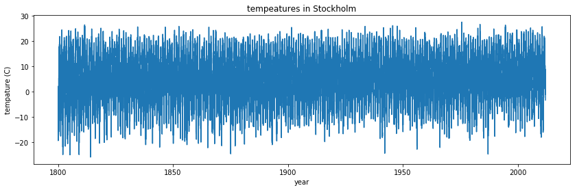

# Introduction à Numpy

### Ahmed Ammar et Hassen Ghalila, dpt Physique, Faculté des Sciences de Tunis, Université de Tunis El Manar


```python
#Juste pour savoir la dernière fois que cela a été exécuté:
import time
print(time.ctime())
```

    Sun May  7 22:58:21 2017


```python
# De quoi s'agit-il de cette ligne?!? Réponse dans le cours MatplotlibIntro.
%pylab inline 
```

    Populating the interactive namespace from numpy and matplotlib


## Introduction

La bibliothèque `numpy` (module) est utilisé dans presque tous les calculs numériques à l'aide de Python. C'est une bibliothèque qui fournit des structures de données vectorielles, matricielles et de dimension supérieure à haute performance pour Python. Il est implémenté dans C et Fortran, alors lorsque les calculs sont vectorisés (formulés avec des vecteurs et des matrices), les performances sont très bonnes.

Pour utiliser `numpy`, vous devez importer le module à l'aide de l'exemple:


```python
from numpy import *
```

Dans la bibliothèque `numpy`, la terminologie utilisée pour les vecteurs, les matrices et les ensembles de données à grande dimension est *array*.

## Création de tableaux `numpy`

Il existe plusieurs façons d'initialiser de nouveaux tableaux numpy, par exemple à partir de

* Une liste Python ou des tuples
* Utilisant des fonctions dédiées à la génération de tableaux numpy, tels que `arange`,` linspace`, etc.
* Lecture de données à partir de fichiers

### De listes

Par exemple, pour créer de nouveaux tableaux vectoriels et matriciels à partir de listes Python, nous pouvons utiliser la fonction `numpy.array`.


```python
# Un vecteur: l'argument de la fonction array est une liste Python
v = array([1,2,3,4])

v
```


    array([1, 2, 3, 4])


```python
# Une matrice: l'argument de la fonction de tableau est une liste de Python imbriquée
M = array([[1, 2], [3, 4]])

M
```


    array([[1, 2],
           [3, 4]])


Les objets `v` et` M` sont tous deux du type `ndarray` que fournit le module` numpy`.


```python
type(v), type(M)
```


    (numpy.ndarray, numpy.ndarray)


La différence entre les tableaux `v` et` M` n'est que leurs formes. Nous pouvons obtenir des informations sur la forme d'un tableau en utilisant la propriété `ndarray.shape`.


```python
v.shape
```


    (4,)


```python
M.shape
```


    (2, 2)


Le nombre d'éléments dans le tableau est disponible via la propriété `ndarray.size`:


```python
M.size
```


    4


De manière équivalente, nous pourrions utiliser la fonction `numpy.shape` et `numpy.size`


```python
shape(M)
```


    (2, 2)


```python
size(M)
```


    4


Jusqu'à présent, le `numpy.ndarray` ressemble beaucoup à une liste Python (ou à une liste imbriquée). Pourquoi ne pas utiliser simplement les listes Python pour les calculs au lieu de créer un nouveau type de tableau?

Il existe plusieurs raisons:

* Les listes de Python sont très générales. Ils peuvent contenir tout type d'objet. Ils sont typiquement typés. Ils ne prennent pas en charge les fonctions mathématiques telles que les multiplications de matrice et de points, etc. L'implémentation de telles fonctions pour les listes Python ne serait pas très efficace en raison de la typage dynamique.
* Les tableaux Numpy sont ** typiquement typés ** et ** homogènes **. Le type d'éléments est déterminé lorsque le tableau est créé.
* Les tableaux Numpy sont efficaces pour la mémoire.
* En raison de la typage statique, la mise en œuvre rapide de fonctions mathématiques telles que la multiplication et l'ajout de tableaux `numpy` peut être implémentée dans une langue compilée (C et Fortran sont utilisés).

En utilisant la propriété `dtype` (type de données) d'un` ndarray`, on peut voir quel type les données d'un tableau ont:


```python
M.dtype
```


    dtype('int64')


Nous obtenons une erreur si nous essayons d'attribuer une valeur du type incorrect à un élément dans un tableau numpy:


```python
M[0,0] = "hello"
```


    ---------------------------------------------------------------------------

    ValueError                                Traceback (most recent call last)

    <ipython-input-14-a09d72434238> in <module>()
    ----> 1 M[0,0] = "hello"
    

    ValueError: invalid literal for int() with base 10: 'hello'


Si nous voulons, nous pouvons définir explicitement le type de données du tableau lorsque nous le créons, en utilisant l'argument de mot-clé `dtype`:


```python
M = array([[1, 2], [3, 4]], dtype=complex)

M
```


    array([[ 1.+0.j,  2.+0.j],
           [ 3.+0.j,  4.+0.j]])


Le type commun qui peut être utilisé avec `dtype` est:` int`, `float`,` complex`, `bool`,` object`, etc.

Nous pouvons également définir explicitement la taille des bits des types de données, par exemple: `int64`,` int16`, `float128`,` complex128`.

#### Utilisation de fonctions génératrices de matrices

Pour les tableaux plus grands, il est inopérant d'initialiser les données manuellement, en utilisant des listes de pythons explicites. Au lieu de cela, nous pouvons utiliser l'une des nombreuses fonctions dans `numpy` qui génère des tableaux de différentes formes. Certains des plus communs sont:

#### arange


```python
# create a range
x = arange(0, 10, 1) # Arguments: start, stop, step
x
```


    array([0, 1, 2, 3, 4, 5, 6, 7, 8, 9])


```python
x = arange(-1, 1, 0.1)

x
```


    array([ -1.00000000e+00,  -9.00000000e-01,  -8.00000000e-01,
            -7.00000000e-01,  -6.00000000e-01,  -5.00000000e-01,
            -4.00000000e-01,  -3.00000000e-01,  -2.00000000e-01,
            -1.00000000e-01,  -2.22044605e-16,   1.00000000e-01,
             2.00000000e-01,   3.00000000e-01,   4.00000000e-01,
             5.00000000e-01,   6.00000000e-01,   7.00000000e-01,
             8.00000000e-01,   9.00000000e-01])


#### linspace et logspace


```python
# En utilisant linspace, les deux points finaux sont inclus
linspace(0, 10, 25)
```


    array([  0.        ,   0.41666667,   0.83333333,   1.25      ,
             1.66666667,   2.08333333,   2.5       ,   2.91666667,
             3.33333333,   3.75      ,   4.16666667,   4.58333333,
             5.        ,   5.41666667,   5.83333333,   6.25      ,
             6.66666667,   7.08333333,   7.5       ,   7.91666667,
             8.33333333,   8.75      ,   9.16666667,   9.58333333,  10.        ])


```python
logspace(0, 10, 10, base=e)
```


    array([  1.00000000e+00,   3.03773178e+00,   9.22781435e+00,
             2.80316249e+01,   8.51525577e+01,   2.58670631e+02,
             7.85771994e+02,   2.38696456e+03,   7.25095809e+03,
             2.20264658e+04])


#### mgrid


```python
x, y = mgrid[0:5, 0:5] # Similaire à meshgrid dans MATLAB
```


```python
x
```


    array([[0, 0, 0, 0, 0],
           [1, 1, 1, 1, 1],
           [2, 2, 2, 2, 2],
           [3, 3, 3, 3, 3],
           [4, 4, 4, 4, 4]])


```python
y
```


    array([[0, 1, 2, 3, 4],
           [0, 1, 2, 3, 4],
           [0, 1, 2, 3, 4],
           [0, 1, 2, 3, 4],
           [0, 1, 2, 3, 4]])


#### random data


```python
from numpy import random
```


```python
# Nombres aléatoires uniformes dans [0,1]
random.rand(5,5)
```


    array([[ 0.18833506,  0.61908035,  0.82407406,  0.66648105,  0.33984563],
           [ 0.56950581,  0.23085039,  0.06931935,  0.78346593,  0.75663626],
           [ 0.83060891,  0.00928922,  0.17144915,  0.59934418,  0.87226107],
           [ 0.20601526,  0.4676143 ,  0.25111431,  0.31004841,  0.10934966],
           [ 0.94912742,  0.47352362,  0.28203614,  0.18393785,  0.19158859]])


```python
# Nombres aléatoires distribués normalisés
random.randn(5,5)
```


    array([[ 1.24233259, -1.56081731,  0.7560079 , -0.35474395,  0.88505342],
           [-1.92600413, -0.25536972,  0.09296484, -0.76565361,  0.98100651],
           [-1.52547362, -0.58595585,  0.09292807, -0.16112747,  2.12238306],
           [ 0.70409189, -0.23339021, -0.19649908, -0.3095259 , -0.63371277],
           [ 0.50526267,  0.17285553,  0.30237303, -0.06148096, -1.33634299]])


#### diag


```python
# Une matrice diagonale
diag([1,2,3])
```


    array([[1, 0, 0],
           [0, 2, 0],
           [0, 0, 3]])


```python
# Diagonale avec décalage de la diagonale principale
diag([1,2,3], k=1) 
```


    array([[0, 1, 0, 0],
           [0, 0, 2, 0],
           [0, 0, 0, 3],
           [0, 0, 0, 0]])


#### zeros et ones


```python
zeros((3,3))
```


    array([[ 0.,  0.,  0.],
           [ 0.,  0.,  0.],
           [ 0.,  0.,  0.]])


```python
ones((3,3))
```


    array([[ 1.,  1.,  1.],
           [ 1.,  1.,  1.],
           [ 1.,  1.,  1.]])


## File I / O


### Valeurs séparées par des virgules (CSV)

Un format de fichier très commun pour les fichiers de données sont les valeurs séparées par des virgules (CSV) ou un format connexe tel que TSV (valeurs séparées par des onglets). Pour lire les données de ce fichier dans les tableaux Numpy, nous pouvons utiliser la fonction `numpy.genfromtxt`. Par exemple,


```python
!head data/stockholm_td_adj.dat
```

    1800  1  1    -6.1    -6.1    -6.1 1
    1800  1  2   -15.4   -15.4   -15.4 1
    1800  1  3   -15.0   -15.0   -15.0 1
    1800  1  4   -19.3   -19.3   -19.3 1
    1800  1  5   -16.8   -16.8   -16.8 1
    1800  1  6   -11.4   -11.4   -11.4 1
    1800  1  7    -7.6    -7.6    -7.6 1
    1800  1  8    -7.1    -7.1    -7.1 1
    1800  1  9   -10.1   -10.1   -10.1 1
    1800  1 10    -9.5    -9.5    -9.5 1


```python
data = genfromtxt('data/stockholm_td_adj.dat')
```


```python
data.shape
```


    (77431, 7)


```python
fig, ax = subplots(figsize=(14,4))
ax.plot(data[:,0]+data[:,1]/12.0+data[:,2]/365, data[:,5])
ax.axis('tight')
ax.set_title('tempeatures in Stockholm')
ax.set_xlabel('year')
ax.set_ylabel('tempature (C)');
```





```python

```
